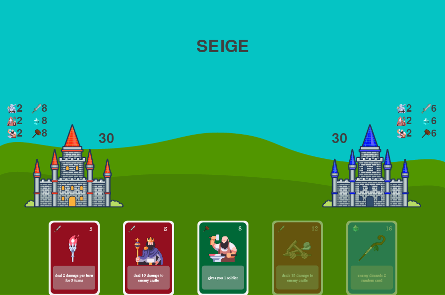

# Marley

Turn based card game built using OOP in python pygame

<!-- TODO: could also granularly control the size with html -->
<!--  -->

## Prerequisites

- **Python**: Ensure you have Python installed. If not, you can download it from [here](https://www.python.org/downloads/).
- **pygame**: This game requires pygame version 2.5.0.

After you clone this repo and install the prerequisites you can run main.py and try it out.

Or you can try it from the browser on my Replit: https://replit.com/@xbromsson/marley?v=1
